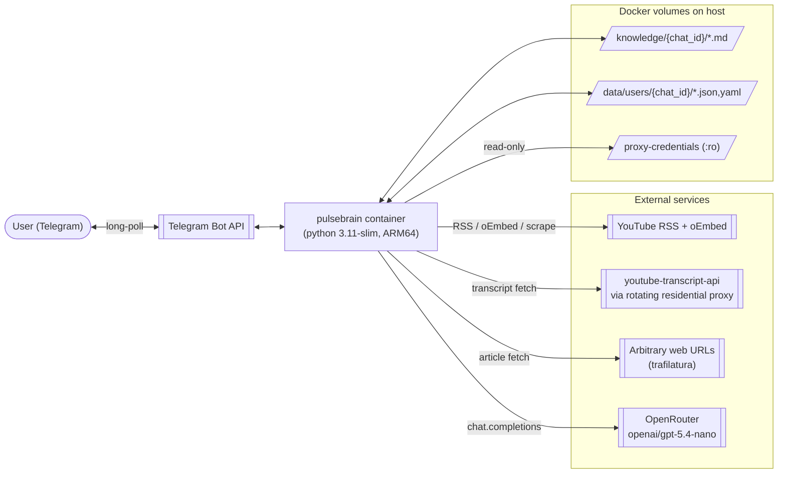
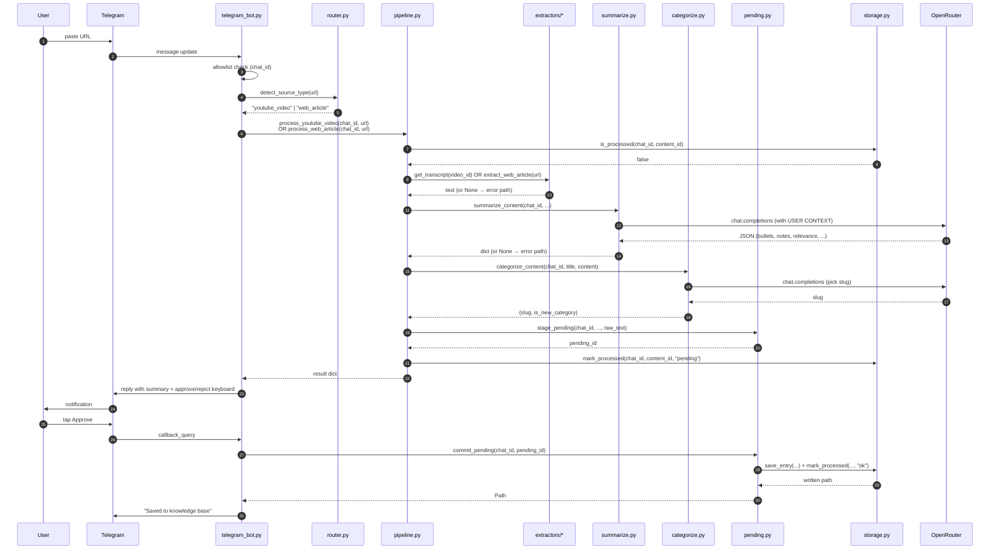
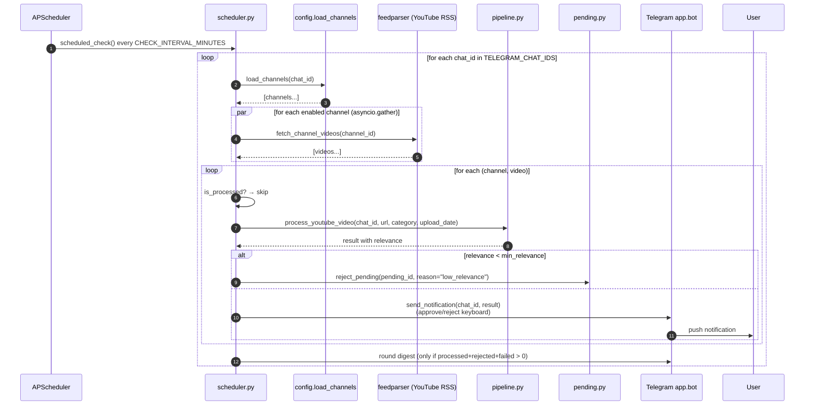
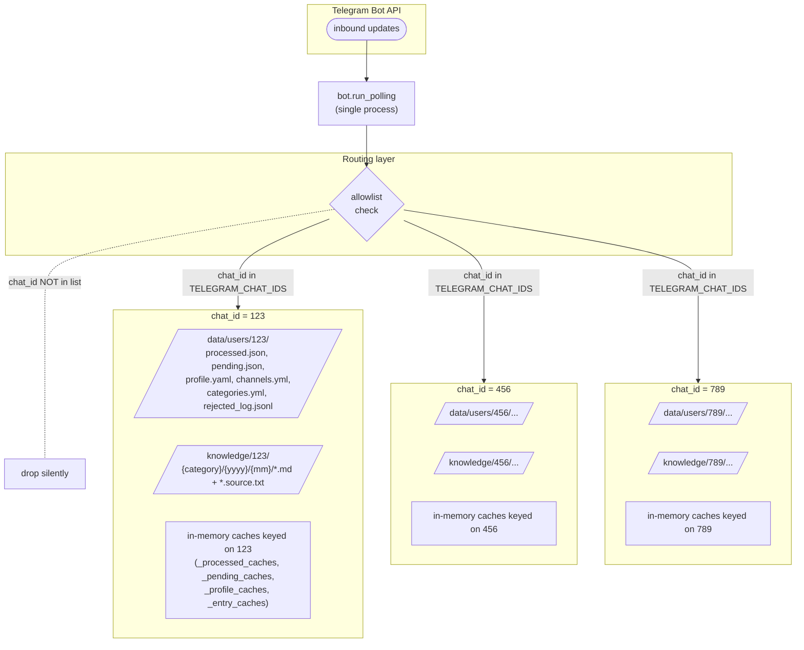

# Architecture

High-level diagrams of PulseBrain. Text-and-diagrams — code references go to [system-context/MODULE_MAP.md](system-context/MODULE_MAP.md); rules go to [system-context/SYSTEM_CONSTRAINTS.md](system-context/SYSTEM_CONSTRAINTS.md).

## System overview



**Deploy target:** Hetzner CAX21 (ARM64, 4 vCPU, 8 GB RAM). One container. No DB.

## Request paths

There are two ways a new entry lands in the knowledge base. Both funnel through [src/pipeline.py](../src/pipeline.py).

### Path A — user drops a link



### Path B — scheduler tick



## Multi-tenant isolation



**Isolation invariants (enforced by [Constraint 2](system-context/SYSTEM_CONSTRAINTS.md#constraint-2-multi-tenant-via-chat_id-threading)):**
- Every persistent file lives under `data/users/{chat_id}/` or `knowledge/{chat_id}/`. Nothing shared on disk.
- Every in-memory cache is `dict[int, ...]` keyed on `chat_id`.
- Each `chat_id` has its own `threading.Lock` for per-file atomic writes.
- The scheduler iterates users serially (not in parallel) so one user's LLM calls don't starve another's.

## Auth & authorization model

- **Single gate:** `TELEGRAM_CHAT_IDS` env var. Parsed at boot by `_parse_chat_entries` in [src/config.py:38](../src/config.py#L38). Supports `id` or `id:Label` per entry, comma-separated.
- **Admin is first entry.** `ADMIN_CHAT_ID = TELEGRAM_CHAT_IDS[0]`. The only special power is receiving migration artifacts on first boot.
- **Every command handler runs allowlist check** before doing any work (see [Constraint 4](system-context/SYSTEM_CONSTRAINTS.md#constraint-4-authorized-users-only-telegram_chat_ids-allowlist)).
- **No OAuth, no API keys per user, no roles.** The allowlist is the whole model.

## Deployment topology

```mermaid
flowchart LR
    dev["Developer<br/>(local)"]
    gh[["GitHub<br/>main branch"]]
    cd[["GitHub Actions<br/>.github/workflows/deploy.yml"]]
    hz["Hetzner CAX21<br/>91.99.143.15<br/>/root/pulsebrain/"]

    subgraph container[pulsebrain container]
        app["python -m src.main<br/>(bot + scheduler)"]
    end

    subgraph host[Host filesystem]
        env[/".env"/]
        knowledge[/"knowledge/"/]
        data[/"data/"/]
        chy[/"channels.yml"/]
        proxy[/"proxy-credentials"/]
    end

    dev -- git push main --> gh
    gh --> cd
    cd -- scp --> hz
    cd -- ssh docker compose build --no-cache && up -d --> hz
    hz --> container
    container <--> env
    container <--> knowledge
    container <--> data
    container <--> chy
    container <-- :ro --> proxy
```

**Deploy cadence:** continuous — every merge to `main` ships. Rollback is `git revert` + push; there is no separate release artifact.

**State lives on the host**, not in the image. `docker compose up -d` after a fresh pull just replaces the binary; user knowledge + state survive.

## Failure & recovery

The scheduler is the long-running component. Each failure mode has a defined recovery:

| Failure | Detection | Recovery |
|---|---|---|
| Container crashes | `restart: unless-stopped` | Docker restarts it. State survives (host volumes) |
| Bot process hangs | No health check — symptom is a user reporting silence | `docker compose restart` on the host |
| OpenRouter API outage | `openai.APIError` caught, item marked `error` | Scheduler continues with next item; user sees localized error next run |
| YouTube transcript fetch blocked | 3 retries exhausted, `get_transcript` returns None | Item dropped from this run; next scheduler tick retries |
| Host reboot | systemd + docker daemon auto-start | Container comes back; volumes intact |
| Lost proxy credentials | `_load_proxy_lines` returns `[]`; warning logged | Direct requests used; expect high failure rate — operator rotates creds file on host |

See [Constraint 5](system-context/SYSTEM_CONSTRAINTS.md#constraint-5-no-crashes-on-single-item-failure) for the "never crash" rule.
